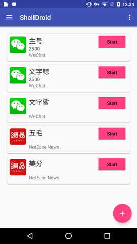
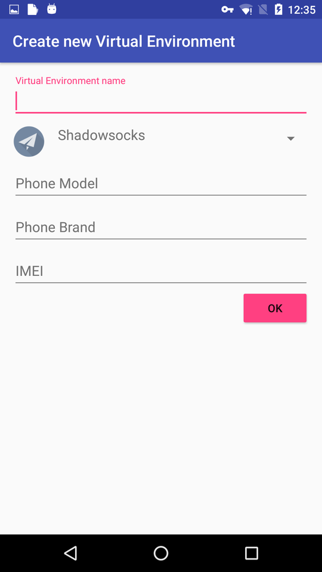
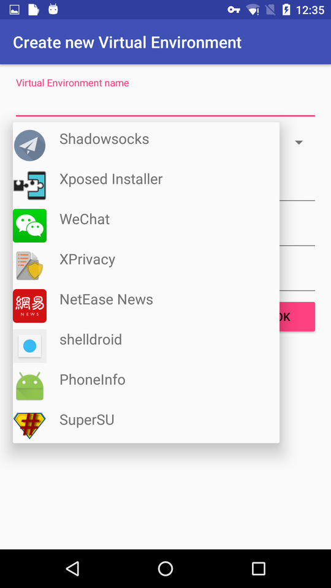

### What is ShellDroid

ShellDroid is an Android App that help you to manage multi account of any App on the same devices. For example, you can use it to switch WeChat or Whatsapp account without reenter your username and password.

The mechanism behind ShellDroid is very simple: Every App on Android has a data folder, when you use that App( login or change some setting) all those information are saved in that folder, ShellDroid manage App's account by manage App's application data. which is simply backup and restore data folder. And that's why it need root privilege.

Some Apps(like Wechat) will try to bind your account with your devices. Those Apps usually use your device's IMEI,phone number, or phone model to identify you. Thanks to [Xposed](http://repo.xposed.info/), ShellDroid can fake those information to make a "portable" application data.

To demonstrate that, I create an [App](https://github.com/wuhx/phoneinfo) which simply call some Android API to identify your devices.  If run it directly, It will display your devices's IMEI, phone model, phone brand etc.(assume  you are not using any other privacy protection Apps of cause)

But if run it from ShellDroid, those information will be replaced by your Virtual Environment settings.

Basically it's a simplified [XPrivacy](https://github.com/M66B/XPrivacy) which not only restrict privacy information access by per App's setting, but also base on the account in that App.  Which means different Account of the same App can have different privacy restriction.

This App is not very complete, but the idea is well proved.

Any issues, fork, pull requests will be welcome.

### Screencast

Download [Video ScreenCast](screencast/record.mp4?raw=true)

### How to build

Install Android SDK(default version 24.4.1),  or change the build.sbt to match your SDK version. Then run:

`sbt apk`

A prebuilt version can be download [here](target/android/output/shelldroid-debug.apk?raw=true)

### Notice

1. Your device need to be rooted.
2. Xposed framework need to be installed.
3. SeLinux will be disabled after ShellDroid get running.
4. Only test on Nexus 5X with Android 6.0. Use at your own risk.

### More  info:

[http://xun.im/2016/05/30/shelldroid-a-virtual-environments-for-android-apps/](http://xun.im/2016/05/30/shelldroid-a-virtual-environments-for-android-apps/)

[http://xun.im/2016/05/30/shelldroid-on-nexus5x/](http://xun.im/2016/05/30/shelldroid-on-nexus5x/)

[http://xun.im/2016/05/30/understand-android-rooting/](http://xun.im/2016/05/30/understand-android-rooting/)

